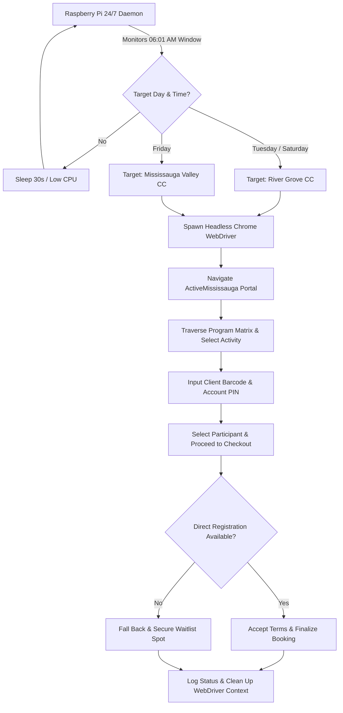

# Mississauga Active Booking Automation

[](https://www.python.org/)
[](https://www.selenium.dev/)
[](https://www.raspberrypi.com/)
[](LICENSE)

An automated headless reservation daemon built with **Python** and **Selenium WebDriver** to secure high-demand municipal sports and recreational time slots (e.g., community center badminton courts) through the City of Mississauga's **ActiveMississauga** booking portal.

Designed to operate continuously on a **Raspberry Pi** or home server, executing automated sub-second bookings the moment registration windows open at **6:01 AM**.

---

## Architecture & Workflow



---

## Features

- **Automated 6:01 AM Reservation**: Eliminates manual latency during peak drop times where slots disappear in seconds.
- **Multi-Account Batch Booking**: Iterates through multiple user credentials (Barcode/PIN pairs) within a single execution cycle.
- **Headless Execution**: Fully optimized for headless Linux environments such as Raspberry Pi with minimal RAM and CPU overhead.
- **Smart Fallback Handling**: Detects if court capacity is reached and automatically secures a spot on the official waitlist.
- **Location & Schedule Routing**: Dynamically directs booking traffic between River Grove and Mississauga Valley community centers based on activity schedules.
- **Production-Ready Daemon**: Includes a native `systemd` service unit with auto-restart and system journal logging.

---

## Project Structure

```
mississaugaBooking/
├── automate.py                  # Core Selenium automation engine & WebDriver abstraction
├── script.py                    # Session invocation and facility dispatch wrappers
├── topLevel.py                  # 24/7 daemon scheduler, CLI entry point, and calendar triggers
├── requirements.txt             # Python dependencies
├── config.example.json          # Example credential and endpoint configuration
├── mississauga-booking.service  # Systemd service unit template for Linux / Raspberry Pi
├── .gitignore                   # Python and environment ignore rules
└── LICENSE                      # MIT License
```

---

## Getting Started

### Prerequisites

1. **Python 3.8+**
2. **Google Chrome** or **Chromium**
3. **ChromeDriver** corresponding to your installed Chrome version

On Debian / Raspberry Pi OS:
```bash
sudo apt update
sudo apt install -y python3 python3-pip chromium-browser chromium-chromedriver
```

### Installation

Clone the repository and install the dependencies:
```bash
git clone https://github.com/Kalp-S/mississaugaBooking.git
cd mississaugaBooking
pip3 install -r requirements.txt
```

---

## Usage

### 1. 24/7 Scheduled Daemon Mode

Pass one or more client credentials as `<Barcode> <PIN>` pairs:

```bash
python3 topLevel.py <BARCODE_1> <PIN_1> [<BARCODE_2> <PIN_2> ...]
```

The daemon will monitor the system clock and automatically trigger bookings at 6:01 AM on Tuesday, Friday, and Saturday.

### 2. Immediate Execution / Dry Run

To test credential validity and browser automation immediately without waiting for the 6:01 AM schedule window:

```bash
python3 topLevel.py --run-once <CLIENT_BARCODE> <ACCOUNT_PIN> [river_grove|valley]
```

---

## Running as a Systemd Service (Raspberry Pi / Linux)

To run the booking automation reliably in the background across system reboots:

1. Copy the service unit to systemd:
   ```bash
   sudo cp mississauga-booking.service /etc/systemd/system/
   ```

2. Edit the service file with your user path and credentials:
   ```bash
   sudo nano /etc/systemd/system/mississauga-booking.service
   ```

3. Reload systemd, enable, and start the daemon:
   ```bash
   sudo systemctl daemon-reload
   sudo systemctl enable mississauga-booking
   sudo systemctl start mississauga-booking
   ```

4. Monitor live status and logs:
   ```bash
   sudo systemctl status mississauga-booking
   journalctl -u mississauga-booking -f
   ```

---

## Security Best Practice

> [!WARNING]
> Never commit raw account barcodes, PINs, or sensitive passwords into version control. Use command-line arguments or environment variables when launching the daemon.

---

## License

This project is licensed under the MIT License - see the [LICENSE](LICENSE) file for details.
